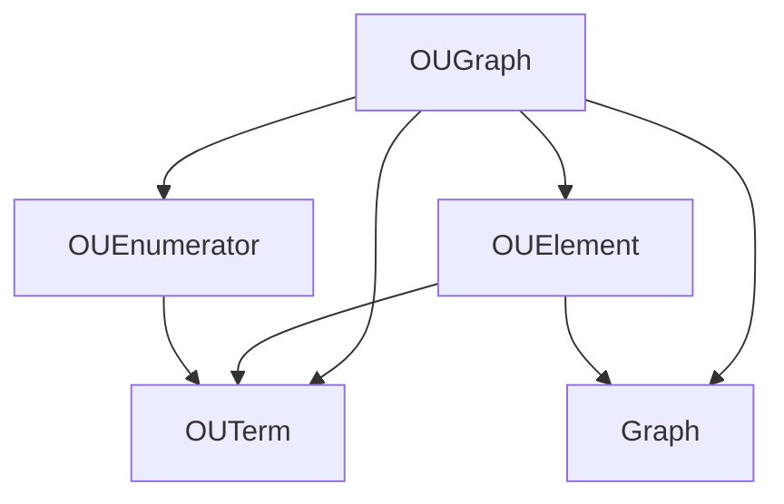

[](https://doi.org/10.5281/zenodo.8214977)
[](https://www.repostatus.org/#active)


[](https://github.com/pre-commit/pre-commit)
[](https://results.pre-commit.ci/latest/github/OntoUML/ontouml-py/main)


# ontouml-py

<p align="center"></p>

Python software that implement validation rules for OntoUML models represented as OntoUML Vocabulary graphs

**📦 PyPI Package:**
The transformation is conveniently [available as a PyPI package](https://pypi.org/project/ontouml-py/), which
allows users to use it as an executable script or import it as a library into other Python projects.

**📚 Documentation:**
For inquiries and further information, please refer to
the [comprehensive docstring-generated documentation](https://w3id.org/ontouml/ontouml-py/docs) available for this
project.

## Contents

<!-- TOC -->

* [ontouml-py](#ontouml-py)
    * [Contents](#contents)
    * [Installation](#installation)
    * [Usage](#usage)
    * [As a script](#as-a-script)
    * [As a library](#as-a-library)

<!-- TOC -->

## Installation

Before using the OntoUML Graph ontouml-py, you need to [download and install Python](https://www.python.org/downloads/).

To install the application you simply need to perform the following command:

```text
pip install ontouml-py
```

All dependencies will be installed automatically, and you will be ready to use the ontouml-py package.

## Introduction

Corresponds to the OntoUML-JS, but for manipulation of RDF graphs.
Enhances RDFLib's functionalities. Treats specific necessities of OntoUML.
Works with the OntoUML vocabulary. Complies with its version 1.1.0.
Under development. Currently, provides limited functionality.


## Concepts

### OUTerm

Refers to a term in the OntoUML Vocabulary. 

Provides usability just like RDFLib does to OWL, RDF, etc. I.e., it can be used like this: 
Examples:
```python
x = OntoUML.Class
ic(x) # result  
```


- Accesses: No other concepts.
- Accessed By: Directly, OUEnumeration, OUGraph, and OUElement.


### RDF Graph

An RDFLib Graph is in this context called simply rdf graph.

- Accesses: No other concepts.
- Accessed By: Directly, OUGraph, OUElement.

### OUGraph

It is intended to be used to aggregate OUElements.
Do not need to be composed of OUElements to exist.
Relates to RDFLib Graphs by load_graph and update_graph methods. 
- Accesses: OUEnumeration, OUTerm, OUElement, Graph. 
- Accessed By: Directly only.

### OUElement

OUElements are classes directly representing OntoUML Vocabulary's classes.
Do not need to be inside an OUGraph to exist.

Have access to OUTerms and Graphs.
- Accesses: OUTerms and Graphs.
- Accessed By: Directly, OUGraphs.

### OUEnumerations

Have access to OUTerms. 
- Accesses: OUTerms.
- Accessed By: Directly, OUGraphs.

## Dependencies



[](https://mermaid.live/edit#pako:eNptjj1vgzAQhv8KuqETiXBjEvDQKVXHDEmWyMsJTEHCNnJt5QPx33NxhFjq6fHd8772CJWtFQhoenutWnQ-Oe2lSegczj8OhzZZrb6Iv3ullfHJx4tN0Mqhty5eT8ppgmjP0Vl_h_81lpJFmpcLxwykQK7Grqafjq-FBN_SCxIEYa0aDL2XIM1EKgZvj3dTgfAuqBTCUKNX-w5_HWoQDfZ_NB3QgBjhBuJzu87zjLOMlYyVO843KdxB8HJNs2zLdgUrCp7lUwoPa6mBxfQlcmybnjWFY_0)

## Contributing

Contribute by informing interesting features, reporting errors or bugs, creating new tests.
Open issue.